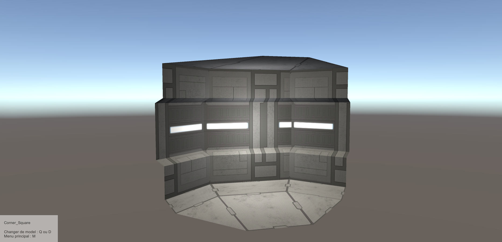
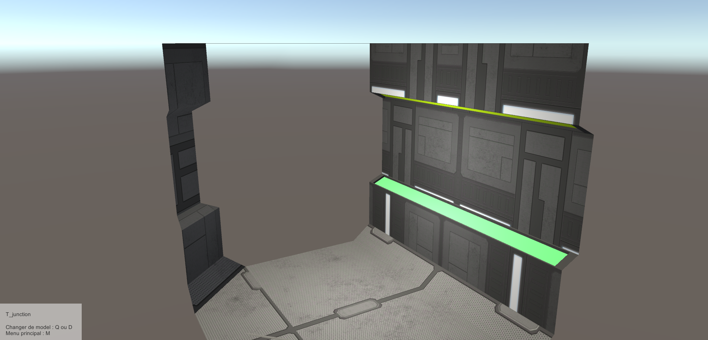
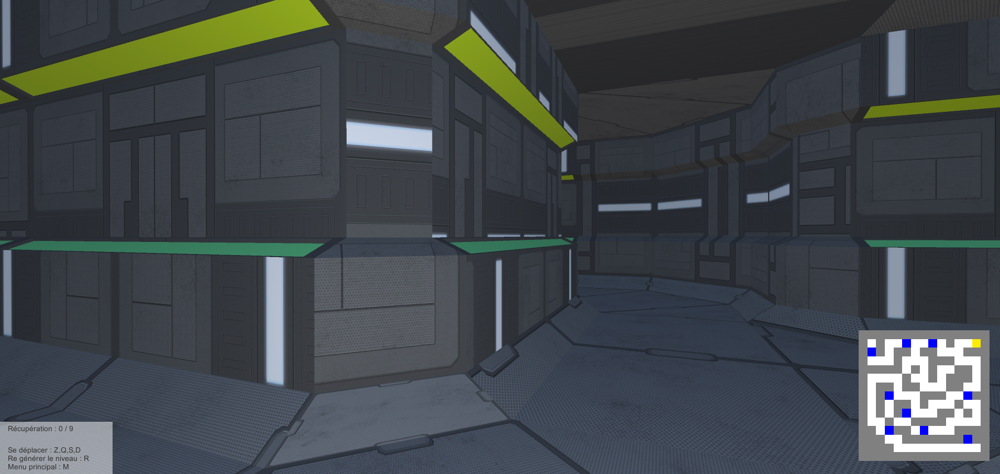
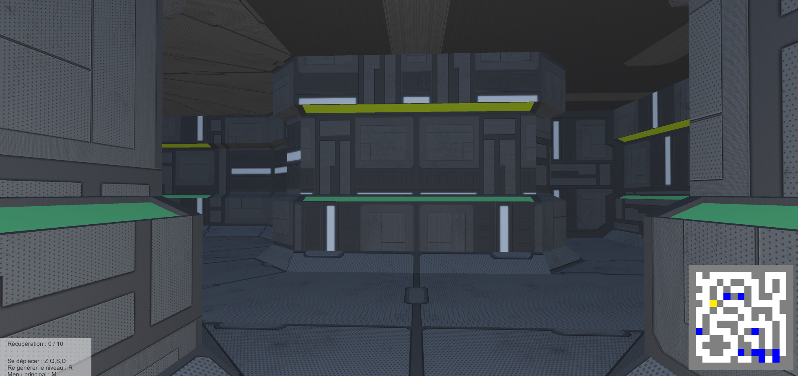

# ModularMaze

## Description
Dans ce projet, on tire profit du caractère modulaire des différents modèles en utilisant la génération procédurale pour créer un labyrinthe.
La galerie permet de visualiser chaque modèle individuellement.

## Screen

## Versions jouable
En ligne : [https://ludovic330.itch.io/maze](https://ludovic330.itch.io/maze)  
Build web : [ModularMaze/Executable/Web](https://github.com/ludovicmantovani/ModularMaze/tree/main/Executable/Web)  
Build windows : [ModularMaze/Executable/Exe](https://github.com/ludovicmantovani/ModularMaze/tree/main/Executable/Exe)  

> Les textures viennent de l'asset store  
> En mode jeu, la minimap reste fixe  
> En mode jeu, une fois que tous les items sont récupérés, il est affiché un message avec "Echap pour revenir au menu" alors que c'est la touche "M"